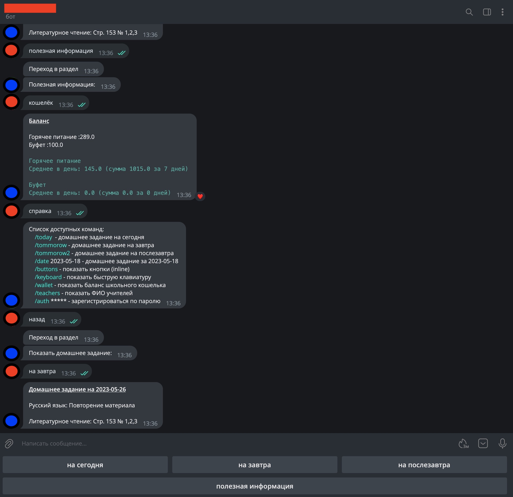

# dnevnik-spb-hw-bot
Telegram bot для просмотра домашнего задания с сайта Электронного дневника портала Петербургского образования 

Умеет:
- показывать домашнее задание на сегодня\завтра\послезавтра
- показывать домашнее задание на выбранную дату
- выводит текущий баланс кошелька (школьное питание)
- выводит средний денежный расход на питание
- показывает ФИО преподавателей и какие они ведут уроки
- показывеат информацию только авторизованным пользователям ("_chat_pass_" - задается в файле _config.json_)
- сохраняет авторизованных в боте пользователей в файле _users.json_ (для многопользовательского доступа)

Для работы требуется:
- зарегистрировать своего бота у _FatherBot_, получить "token" и добавить его в файле _config.json_
- придумать свой пароль для авторизации и прописать его в "_chat_pass_" (файл _config.json_)
- узнать своё значение cookie: "_X-JWT-Token_", с помощью _get_dnevnik_token.py_ (или например через chrome extension - [EditThisCookie](https://chrome.google.com/webstore/detail/editthiscookie/fngmhnnpilhplaeedifhccceomclgfbg)) на сайте [dnevnik2](https://dnevnik2.petersburgedu.ru)

Выгдядит так:
.
